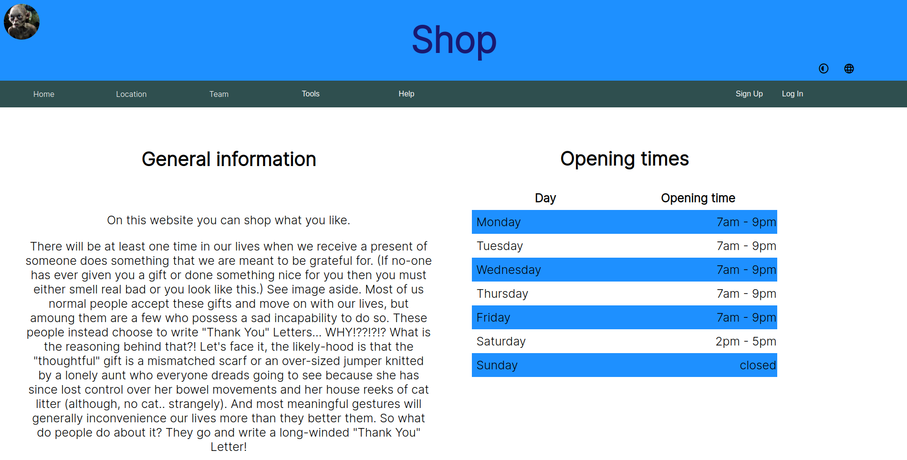
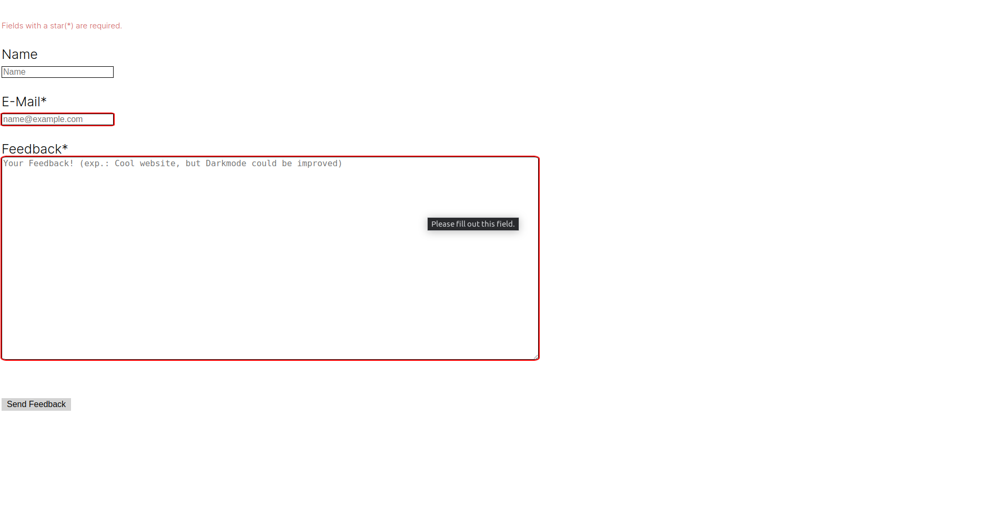

# planeo_internship

This project is for me to get to know the basics of html, css, etc.

## Documentation

In this project there is a documentation of what I have found out and learned in regard to the basics. That means common
commands as well as the most vital features.

## Website

In order to get to know the programmes I am building a website. Even though it isn't perfect, it is a beautiful website.
You should check it out sometime :)

This is what my homepage looks like right now:\
</img>

Here is another one of the feedback page :)\
</img>

## Docker

To open the website with Docker you have to start the docker compose:
```
sudo docker compose up -d
# The d flag detaches the Docker compose to run it in the background
```
Now the website should be accessible with http://localhost:8080/.